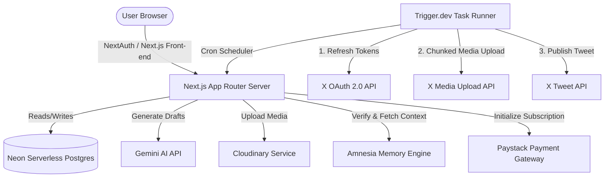
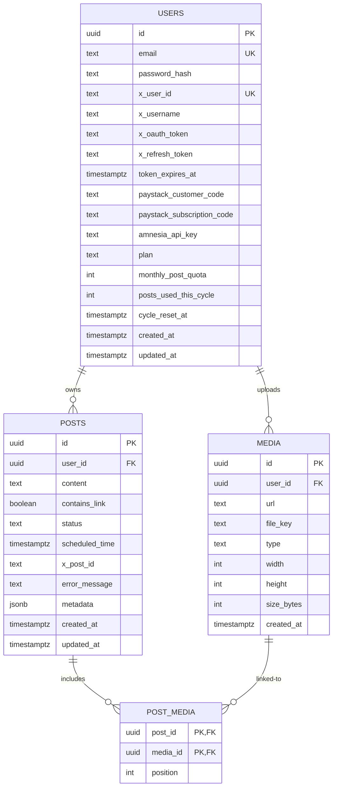

# Genpost — Under the Hood (How It Works)

Genpost is a multi-tenant SaaS application that automates X (Twitter) content creation and scheduling. It leverages **Google Gemini AI** for content generation, **Amnesia** as a personalized user-voice memory store, **Cloudinary** for media storage, **Trigger.dev** for background scheduling, and **Paystack** for global/local billing.

This document provides a comprehensive technical breakdown of how the application operates. It is designed to help you explain the system's architecture, data flow, and engineering decisions to an interviewer or a technical peer.

---

## 🏗️ System Architecture & Tech Stack



*   **Frontend & Backend**: Next.js App Router (React) written in TypeScript, styled with Tailwind CSS.
*   **Database**: Neon Serverless Postgres (utilizing `@neondatabase/serverless` WebSocket pools to minimize cold-start latency).
*   **Authentication**: NextAuth.js (Auth.js) Credentials Flow utilizing stateless JWT session cookies and Bcrypt-hashed password storage.
*   **AI Engine**: Google Gemini AI (using the official `@google/genai` Node SDK) running the `gemini-2.5-flash` model.
*   **Memory Engine**: Amnesia (external API) for persona/voice matching.
*   **Media Storage**: Cloudinary for secure image and video hosting.
*   **Background Jobs**: Trigger.dev background worker for task scheduling and reliable cron processing.
*   **Billing**: Paystack for Region-Specific Multicurrency payments (NGN for African visitors, USD globally).

---

## 🗄️ Database Schema & Data Modeling

The Neon Postgres database is structured to support multi-tenancy, token security, and media-rich scheduling.



### Key DB Design Decisions:
1.  **Strict X Account Uniqueness**: A partial index `idx_users_x_user_id_unique` is defined on `users(x_user_id) WHERE x_user_id IS NOT NULL`. This prevents multiple Genpost users from connecting the same X account while allowing users with no connected X account to co-exist without collision.
2.  **Orderable Media Attachments**: The `post_media` join table maps `post_id` to `media_id` alongside a `position` integer. This supports multiple images per tweet (up to 4, mimicking X's native layout grid) while preserving their specific order.
3.  **Cascading Deletions**: Deleting a user cleans up their posts and media files automatically via standard database cascades, ensuring no dangling data remains.

---

## 🔑 Deep Dive: Secure X (Twitter) OAuth 2.0 PKCE & Token Storage

Connecting X accounts securely is central to the application. X uses **OAuth 2.0 Authorization Code Flow with PKCE**.

```
[User Browser] -> [Click Connect X] -> [Next.js App generates Code Verifier]
                                             |
[User approves on X] <- [Redirected to X with State & Code Challenge]
        |
        +-> [Redirected back to /api/auth/x/callback?code=...&state=...]
                                             |
[Next.js Server exchanges code for Token Pair] -> [Encrypt tokens & save to Neon]
```

### Encryption of Sensitive Tokens
Tokens are never stored in plaintext. They are encrypted using **AES-256-GCM** inside [`genpost/lib/crypto.ts`](file:///c:/Users/HP/Documents/Projects/Genpost_automation/genpost/lib/crypto.ts):
*   **Encryption**: Generates a 96-bit (12-byte) cryptographically secure random Initialization Vector (IV). It performs AES-256-GCM encryption and retrieves the 128-bit authentication tag. The output is structured as `iv.toBase64() + "." + authTag.toBase64() + "." + ciphertext.toBase64()`.
*   **Decryption**: Splits the token string by the period delimiter, reconstructs the IV, auth tag, and ciphertext buffers, and decrypts using the native `crypto` decipher.

### Proactive Token Refresh
X API access tokens expire every 2 hours. To avoid silent task failures, the background scheduler resolves active tokens through [`getValidXToken()`](file:///c:/Users/HP/Documents/Projects/Genpost_automation/genpost/lib/x-oauth.ts#L31):
*   It checks the `token_expires_at` timestamp.
*   If the token is within a **5-minute expiration buffer**, it automatically requests a token refresh from `https://api.x.com/2/oauth2/token` using the encrypted refresh token, updates the database with the new credentials, and returns the active token.

---

## 🤖 Personalized Content Generation (Gemini + Amnesia)

Standard AI generation results in generic, predictable writing. Genpost solves this by combining the **Amnesia Memory Engine** with **Google Gemini**.

```
[Topic query: "Python"] -> [Query Amnesia context API]
                                   |
[Build voice traits & past posts block] -> [Append custom tone instructions]
                                   |
[Submit structured JSON prompt to Gemini API] -> [Store parsed JSON posts as Drafts]
```

1.  **Retrieving Writing Context**: When generating drafts, the server queries the Amnesia API (`/api/context`) using the user's encrypted Amnesia API key and the topic list. It fetches:
    *   **Core Profile Traits**: Facts, preferences, and events about the user.
    *   **Episodic Snippets**: Text snippets of the user's actual past writing/posts.
2.  **Structuring the Prompt**: [`formatMemoryPromptBlock()`](file:///c:/Users/HP/Documents/Projects/Genpost_automation/genpost/lib/amnesia.ts#L119) processes these details into clear markdown sections:
    *   *Traits*: Tone/voice guidelines the model should adapt to without explicitly quoting.
    *   *Snippets*: Exact vocabulary, syntax patterns, and rhythm references for the AI to emulate.
3.  **Generating via Gemini**: The server fires a request to Gemini `gemini-2.5-flash` using the official `@google/genai` library.
    *   **Structured Outputs**: It sets `responseMimeType: "application/json"` and supplies a schema requiring `posts` containing `topic`, `type`, `content`, and `character_count` to guarantee clean UI parsing.
    *   **Post-Ingestion Safeguard**: The system restricts Amnesia memory ingestion to user-submitted Settings profile notes via `pushProfileFacts`—automatic post ingestion of AI-generated content is intentionally disabled to avoid contaminating the user's authentic writing memory.

---

## 🖼️ Unified Media Upload System (Cloudinary)

Users can enrich their scheduled posts with media (up to 4 images or 1 video).

1.  **Frontend Uploading**: The dashboard uses a custom multi-file parallel fetch-based upload handler to send selected files directly to a custom Next.js endpoint `/api/media/upload`.
2.  **Backend Verification & DB Insertion**:
    *   The `/api/media/upload` route handler validates that the request is from a logged-in user using `getServerSession`.
    *   It verifies the file sizes (images up to 4MB, videos up to 16MB) and uploads the file to Cloudinary using the Node SDK client.
    *   On completion, the route inserts the file metadata (secure URL, public ID as `file_key`, type, size, dimensions) into the Postgres `public.media` table.
3.  **Draft Customization**: Users can view the media preview rendered in an X-style responsive grid (determined by image counts). They can attach or remove files as needed before scheduling.
4.  **Orphaned File Clean Up**: To prevent cloud storage bloat, when a post or media association is deleted, Genpost triggers `cloudinary.uploader.destroy(file_key, { resource_type })` in parallel to immediately purge the files from Cloudinary alongside deleting the database records.

---

## ⏰ Background Scheduling & Twitter/X Chunked Uploads

The scheduled posting engine is handled by a Trigger.dev background worker configured as a cron task running every minute.

```
[Cron triggers every minute] -> [Query public.posts for due "approved" posts]
                                                      |
    [X OAuth Token Refresh] <-------------------------+
              |
    [Upload media via Chunked Upload Flow]
              |
              +--> [1. INIT: Send total bytes & media category]
              +--> [2. APPEND: Upload media in 1MB chunks]
              +--> [3. FINALIZE: Request processing completion]
              +--> [4. STATUS: Poll processing state until complete]
              |
    [Post tweet payload to /2/tweets] -> [Increment monthly quota usage counters]
```

### The Chunked X Media Upload Flow:
Standard API posts fail for large media or videos. The background worker uses X's official chunked media upload flow:
1.  **INIT**: Issues a `POST` request to `https://upload.twitter.com/1.1/media/upload.json` with command `INIT`, total file bytes, media mime-type, and category (`tweet_image` or `tweet_video`). X returns a stable `media_id_string`.
2.  **APPEND**: Splits the media buffer into **1MB chunks** and calls the `APPEND` endpoint sequentially for each chunk, linking them to the `media_id_string` with a segment index.
3.  **FINALIZE**: Calls `FINALIZE` to notify X that upload is complete.
4.  **STATUS Polling**: For videos and larger files that require background transcodes, the worker enters a validation loop, checking the `STATUS` command endpoint every few seconds until the state transitions from `pending` / `in_progress` to success.
5.  **Publishing & Cleanup**: Once all attachments are uploaded, it compiles the payload, issues the `/2/tweets` creation call, marks the database post as `posted` with the resulting `x_post_id`, and increments the user's monthly usage count.

---

## 💳 Region-Specific Billing & Webhooks (Paystack)

To maximize conversion across different markets, Genpost uses region-aware pricing and billing entirely handled via **Paystack**.

1.  **Geo-IP Routing**: In [`lib/geo.ts`](file:///c:/Users/HP/Documents/Projects/Genpost_automation/genpost/lib/geo.ts), Genpost maps user locations (derived from request headers, e.g., Cloudflare/Vercel country headers) against a lookup set of 56 African nations (`AFRICAN_COUNTRY_CODES`).
2.  **Currency Determination**: African users are routed to local currency (NGN) checkout flows with Purchasing Power Parity (PPP) adjusted rates, while global users are routed to US Dollar (USD) plans.
3.  **Paystack Checkout**: The `/api/billing/checkout` endpoint initializes payments using Paystack's Transaction Initialization API, directing the user to a secure payment page.
4.  **Webhook Syncing**: An API endpoint `/api/webhooks/paystack` listens for secure, cryptographically validated webhooks (using HMAC-SHA512 with the secret key `x-paystack-signature`):
    *   `charge.success`: Upgrades the user's plan and increases their monthly post quota in the `public.users` table.
    *   `subscription.disable`: Disables the active plan and downgrades the user's limits.
